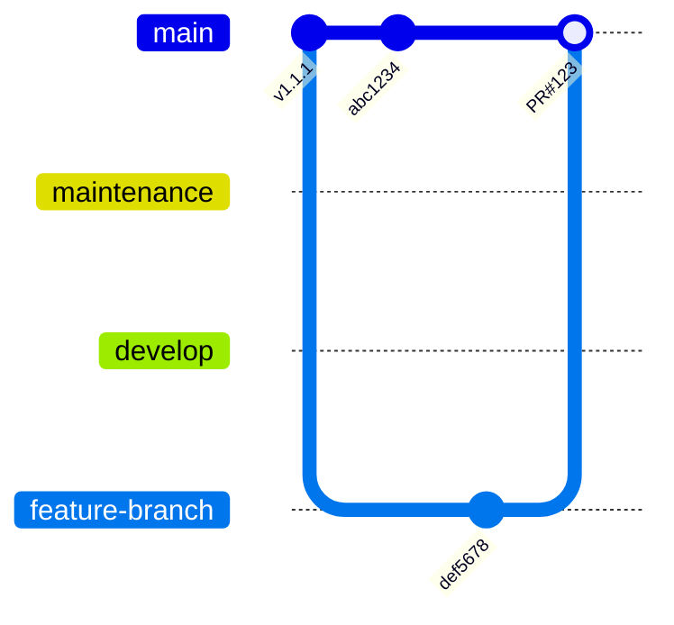

# Git Mermaid Graph Generator

A Python script that automatically generates mermaid gitGraph visualizations from git commit history since a specified tag.

## Features

- **Configurable base tag**: Specify any git tag as the starting point for analysis
- **Branch filtering**: Exclude specific branches from the visualization
- **Automatic analysis**: Analyzes commit history, merge patterns, and branch relationships
- **Rich visualization**: Generates mermaid gitGraph with proper branch structure and merge flows
- **Detailed summary**: Provides statistics and analysis of the commit history

## Requirements

- Python 3.6+
- Git repository with commit history
- Git command-line tool installed and accessible

## Usage

### Basic Usage

```bash
# Generate visualization since v1.1.1 (default)
python git_mermaid_generator.py

# Specify a different tag
python git_mermaid_generator.py --tag v1.0.0

# Exclude specific branches
python git_mermaid_generator.py --exclude-branches "refs/stash,origin/HEAD,feature-branch"

# Specify output filename
python git_mermaid_generator.py --output my_git_graph.md
```

### Command Line Options

- `--tag TAG`: Git tag to use as starting point (default: `v1.1.1`)
- `--exclude-branches BRANCHES`: Comma-separated list of branch patterns to exclude
- `--output OUTPUT`: Output filename (default: `git_commits_since_<tag>.md`)
- `--help`: Show help message

### Examples

```bash
# Analyze commits since v2.0.0, excluding stash and specific feature branches
python git_mermaid_generator.py --tag v2.0.0 --exclude-branches "refs/stash,origin/HEAD,old-feature"

# Generate with custom output file
python git_mermaid_generator.py --tag v1.1.1 --output project_history.md

# Minimal exclusions
python git_mermaid_generator.py --exclude-branches "refs/stash"
```

## Output

The script generates a markdown file containing:

1. **Mermaid GitGraph**: Visual representation of the commit history
2. **Analysis Summary**: Statistics including:
   - Total commits analyzed
   - Number of merge vs regular commits
   - Active branches count
   - Version tags found
   - Top contributors
   - Analysis metadata

### Sample Output Structure

```markdown
# Git Commits Since v1.1.1 - Mermaid GitGraph Visualization



## Summary of Changes Since v1.1.1
...
```

## How It Works

1. **Tag Verification**: Verifies the specified tag exists in the repository
2. **Branch Discovery**: Identifies all branches, filtering out excluded patterns
3. **Commit Analysis**: Extracts commit history with detailed metadata
4. **Merge Detection**: Identifies merge commits and their relationships
5. **Graph Generation**: Creates mermaid gitGraph syntax with proper structure
6. **Summary Creation**: Generates statistical analysis of the changes

## Limitations

- Limited to 30 most recent commits for readability
- Branch names are sanitized (hyphens replaced with underscores)
- Complex merge patterns may be simplified for clarity
- Requires git command-line access

## Error Handling

The script includes robust error handling for:
- Missing git repository
- Non-existent tags
- Unicode encoding issues in commit messages
- Git command failures

## Customization

The script can be easily extended to:
- Add more commit metadata
- Customize mermaid graph styling
- Include additional branch filtering logic
- Export to different formats

## License

This script is provided as-is for educational and development purposes.